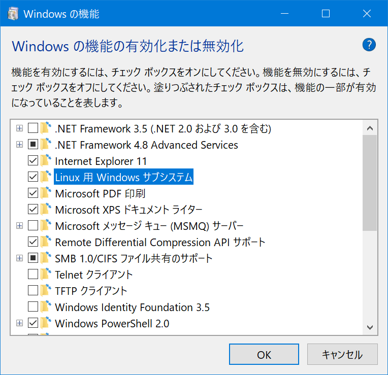

# CDSL 開発標準ガイド Draft

# はじめに

- 対象とする読者
- 資料の目的
- 検証環境 -> 原則としてWindowsのみサポートする．MacやLinuxでわからなければWindowsを使う．

## WSL2

WSLはWindows Subsystem for Linuxの略です。これはWindows上でLinux環境を用意する方法の一つです。

インストール手順

Windows 10のマシンを用意します。

(1) Windowsのビルドバージョンを確認します。

スタートメニューを開き，`winver`と入力します。

表示されたWindows 10のビルドが2004以上であればOKです。2004未満の場合はWindows Updateを行います。

(2) WSLの有効化を行います。

コントロールパネルから...




(3) WSLのディストリをインストールします。

```
wsl.exe --install --distribution ＜WSLディストリビューション名＞
```

## Linuxコマンド

タブキーによる補完

コマンドの基本操作

## テキストエディタ - VisualStudio Code

Visual Studio CodeはMicrosoftが公開しているテキストエディタです．以下のURLからインストーラをダウンロードして，インストールしてください．

https://code.visualstudio.com/

TODO

- 便利な拡張
- 便利なショートカットキー

## テキストエディタ - Nano

Nanoはコマンドラインで動作する軽量なテキストエディタです．UbuntuをはじめとするLinux上での操作で使用します．

UbuntuへのNanoのインストールは次のコマンドを使います．

```bash
sudo apt install -y nano
```

テキストファイル `a.txt` を編集するには次のコマンドを使います．

```
nano a.txt
```

保存するには...

終了するには...

## プログラミング言語 - Python

開発環境

- flake8
- autopep
- vscodeの設定
- venv

## データベース - MySQL

- RDB
  - データベース
  - テーブル
  - カラム
  - レコード
- SQL
- テーブル設計

## Git - GitHub

- バージョン管理
- コミット
- リポジトリ
- ブランチ

## コンテナ - Docker

TBD

## コンテナの制御・管理 - Kubernetes

TBD

## シェルスクリプト

TBD
